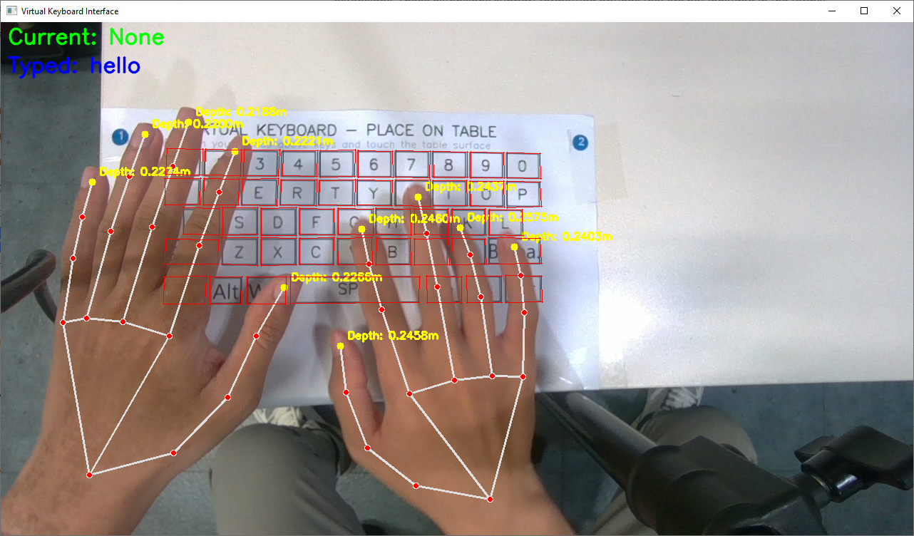

<p align="center">
  <h1 align="center">Real-Time Multimodal Fingertip Contact Detection<br>via Depth and Motion Fusion for Vision-Based HCI</h1>
  <p align="center">
    <strong>CVPR 2026</strong>
    <br />
    <a href="https://orcid.org/0000-0002-8819-852X">Mukhiddin Toshpulatov</a><sup>1,2,4,5</sup> &middot;
    Wookey Lee<sup>2</sup> &middot;
    Suan Lee<sup>3</sup> &middot;
    Geehyuk Lee<sup>1</sup>
    <br />
    <sup>1</sup>KAIST &nbsp;&nbsp; <sup>2</sup>BMSE, Inha University &nbsp;&nbsp; <sup>3</sup>Semyung University &nbsp;&nbsp; <sup>4</sup>Gachon University, South Korea &nbsp;&nbsp; <sup>5</sup>Jizzakh branch of the National University of Uzbekistan, Uzbekistan
  </p>
</p>

<p align="center">
  <a href="#"></a>
  <a href="LICENSE"></a>
  <a href="#"></a>
  <a href="https://muxiddin19.github.io/Multimodal-Fingertip-Contact-Detection-via-Depth-and-Motion-Fusion/"></a>
</p>

<p align="center">
  
</p>

## About

A vision-based virtual keyboard system that detects fingertip contact events in real-time using monocular depth estimation and motion analysis. Our fine-tuned Depth Anything V2 achieves **3.2mm MAE** at close range, enabling **94.2% contact detection accuracy** and **45.6 WPM** typing at 30 FPS on consumer hardware.

## Quick Start

### Requirements

- Python >= 3.10, CUDA >= 11.8
- Intel RealSense D405 camera (for live demo)

```bash
git clone https://github.com/muxiddin19/Multimodal-Fingertip-Contact-Detection-via-Depth-and-Motion-Fusion.git
cd Multimodal-Fingertip-Contact-Detection-via-Depth-and-Motion-Fusion
pip install -r requirements.txt
```

### Download Model Weights

```bash
mkdir -p checkpoints

# Our fine-tuned model (D405 close-range, max_depth=0.5)
wget -P checkpoints/ https://huggingface.co/muxiddin19/vrkeyb-cvpr2026/resolve/main/depth_anything_v2_vits_d405_finetuned.pth

# Base DA2-ViTS (optional, for comparison)
wget -P checkpoints/ https://huggingface.co/depth-anything/Depth-Anything-V2-Small/resolve/main/depth_anything_v2_vits.pth
```

### Run the VR Keyboard

```bash
python vr_keyboard_cvpr2026_v7.py
```

**Controls:**
| Key | Action |
|-----|--------|
| `A` | Auto-calibrate keyboard surface |
| `D` | Toggle debug visualization |
| `M` | Show performance metrics |
| `Q` | Quit |

## Key Results

| Metric | Value |
|--------|-------|
| Depth MAE | 3.2 mm (down from 12.8 mm pre-trained) |
| Contact Accuracy | 94.2% |
| F1-Score | 94.4% |
| Typing Speed | 45.6 WPM |
| Character Error Rate | 3.1% |
| Inference Speed | 30 FPS (RTX 3060 Ti) |

## Project Structure

```
.
├── vr_keyboard_cvpr2026_v7.py       # Main VR keyboard application
├── src/                              # Core modules
│   ├── depth_model_manager.py        #   Depth Anything V2 inference (max_depth=0.5)
│   ├── depth_tracker.py              #   Velocity-gated hysteresis contact detector
│   ├── camera_manager.py             #   Intel RealSense D405 interface
│   ├── hand_tracker.py               #   MediaPipe hand landmark detection
│   ├── keyboard_manager.py           #   Keyboard layout and key mapping
│   ├── depth_colorizer.py            #   Depth map visualization
│   ├── keyboard_annotation.py        #   Keyboard annotation tool
│   ├── one_euro_filter.py            #   1-Euro temporal smoothing
│   └── visualization_utils.py        #   Display utilities
├── assets/                           #   Keyboard layout files
├── images/                           #   Demo screenshots
├── checkpoints/                      #   Model weights (download separately)
│
├── custom_data_recording/            # D405 data recording tools & guide
├── data_preprocessing/               # Dataset preparation & split generation
├── depth_finetuning/                 # Depth Anything V2 fine-tuning code
├── dataset/                          # Dataset description & download links
├── evaluation/                       # Evaluation scripts
├── paper/                            # CVPR 2026 paper & supplementary
├── docs/                             # Project page (GitHub Pages)
│
├── requirements.txt
├── LICENSE
└── CITATION.cff
```

Each subfolder contains its own `README.md` with detailed instructions.

## Contact Detection Method

The system uses a **velocity-gated hysteresis state machine** that fuses:
1. **Depth distance**: fingertip-to-surface distance from fine-tuned Depth Anything V2
2. **Motion velocity**: fingertip downward velocity from temporal tracking

| Parameter | Value |
|-----------|-------|
| Contact entry threshold | 4.5 mm |
| Contact exit threshold | 6.0 mm |
| Cooldown period | 450 ms (~15 frames) |
| Depth model | DA2-ViTS fine-tuned, max_depth=0.5 |

## Citation

```bibtex
@inproceedings{toshpulatov2026realtime,
  title={Real-Time Multimodal Fingertip Contact Detection via Depth and Motion
         Fusion for Vision-Based Human-Computer Interaction},
  author={Toshpulatov, Mukhiddin and Lee, Wookey and Lee, Suan and Lee, Geehyuk},
  booktitle={Proceedings of the IEEE/CVF Conference on Computer Vision
             and Pattern Recognition (CVPR)},
  year={2026}
}
```

## License

This project is released under the [Apache 2.0 License](LICENSE).

## Acknowledgements

- [Depth Anything V2](https://github.com/DepthAnything/Depth-Anything-V2) for the base depth estimation model
- [MediaPipe](https://github.com/google/mediapipe) for hand landmark detection
- [Intel RealSense](https://github.com/IntelRealSense/librealsense) for depth camera SDK
